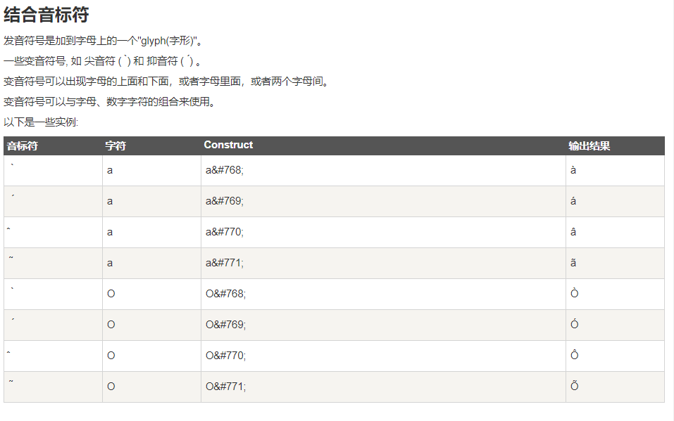

# 工程简介

# javascript学习资料

[javaScript学习教程](https://www.runoob.com/js/js-tutorial.html)

[html教程](https://www.runoob.com/html/html-tutorial.html)

[html5前端约束验证](https://www.runoob.com/html/html5-form-attributes.html)

[javaScript前端检验](https://www.runoob.com/js/js-validation-api.html)

[web workers教程](https://www.runoob.com/html/html5-webworkers.html)

[html5应用缓存](https://www.runoob.com/html/html5-app-cache.html)

[html事件大全](https://www.runoob.com/jsref/dom-obj-event.html)

[jQuery教程](https://www.runoob.com/jquery/jquery-selectors.html)

[jQuery的Ajax教程](https://www.runoob.com/jquery/jquery-ajax-intro.html)

[jQuery选择器](https://www.runoob.com/jquery/jquery-selectors.html)

[jQuery-validator](https://www.runoob.com/jquery/jquery-plugin-validate.html)

# 延伸阅读

